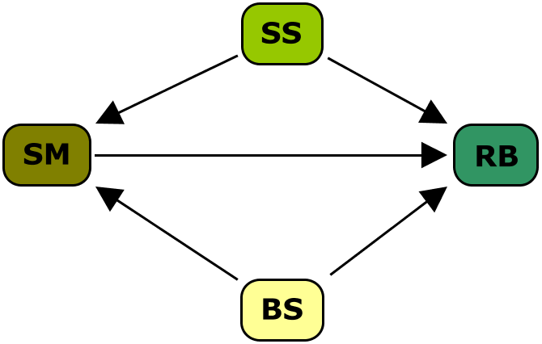
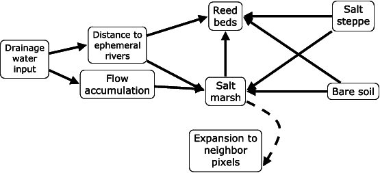
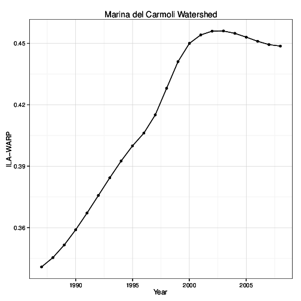
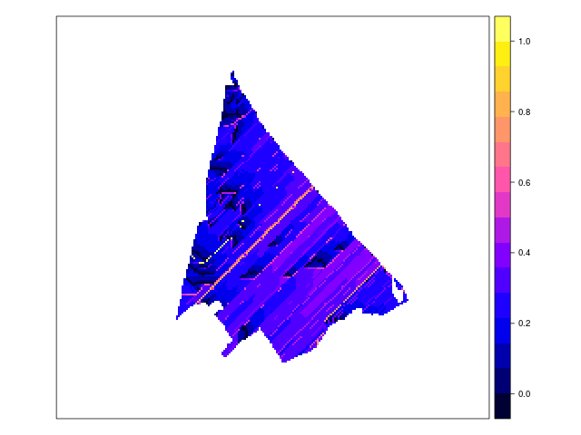

# How does the model work?

The Marina del Carmoli wetland mainly comprises salt steppe, salt marsh and reed bed areas, which are distributed according to the availability of water and salinity. Salt steppe is located in areas with low water availability and high salinities; reed beds (*Phragmites australis*) are in areas with high water content and low salinity, whereas  salt marsh occupies areas with intermediate water content and higher salinity. Salt steppe is considered of Priority interest according to the European Habitat Directive, salt marsh is of Community interest and reed beds are not included in the Directive.

The three above-mentioned plant community types (*i.e.* salt steppe, salt marsh and reed beds) and the bare soil were the state variables of the model and were represented as four continuous raster maps, according to the initial maps of salt steppe, salt marsh and bare soil in the wetland that were established by means of remote sensing in year 1984, originally resampled to a pixel size of 25x25 m.

The maximum total abundance of plant communities and bare soil in each pixel was limited to 25 units. Conversion among plant communities was caused by the drainage water input to the wetland and mediated by spatial environmental variables influencing water availability and growth.

The model assumes only increasing or no water inputs, thus accounting only for the conversion of drier and more saline plant communities to more humid or less saline ones, *i.e.* salt steppe and bare soil (initially present) into salt marsh, and for the conversion of all of them into reed beds.

In this regard, the model only accounts for the growth and expansion of the reed beds and salt marsh communities, considering the decrease of salt steppe and bare soil as a side effect of the growth of salt marsh and reed beds (figure 4). Model variables and parameters were established using a deterministic approach based on the knowledge of the ecological tolerance of the plant communities and environmental variables.

Since reed bed stands were not dense enough to be mapped by remote sensors at that early stage, we did not know their initial location in the wetland and therefore they were assumed to be potentially present in all wetland pixels with an initial value of one unit in each pixel. As an invasive and clonal species which spreads rapidly by extending its rhizomes in all directions, this seemed an ecologically meaningful assumption. Since this is the most typical plant community present under wet conditions, we considered this as a reasonable assumption.

Spatial neighborhood algorithms were developed and included in the model in order to allow the salt marsh community to disperse to the surrounding pixels. Since only increasing changes in water inputs were considered in the model, the dispersion of salt marsh was limited to neighboring pixels containing bare soil or salt steppe, which are negatively affected by these pressures. Figure 5 shows the conceptual diagram of the model.

## Driving force and environmental variables

In order to assess the agricultural hydrological pressures coming from the watershed over time, first the watershed area draining to the wetland was delineated from a raster DEM (10x10 m) using GRASS GIS 6.4. Historical watershed land cover maps for years 1987, 1996, 2000 and 2008 were obtained by means of remote sensing techniques.

The percentage of irrigated agricultural areas in the watershed was then calculated and converted into a Wetland Area Relative Percentage index (WARP), which was included in the model as a forcing input representing the agricultural hydrological pressure on the wetland over time (ILA_WARP). Values for intermediate years were obtained by means of linear interpolation (Figure 6).

The environmental factors considered in the model at wetland scale were:

 1. the distance to two ephemeral rivers crossing the wetland (figure 7) and
 2. the potential surface flow accumulation over the wetland area, as a proxy of waterlogging (figure 8).

Maps of distance of each pixel to the ephemeral rivers crossing the wetland were produced by means of map algebra operations using a digitized river network. The surface flow accumulation map over the wetland area was derived from a DEM by means of a watershed modelling operation using GRASS GIS. The resulting maps of flow accumulation and distance to ephemeral rivers were scaled to a zero to one range.

## Potential growth rate and water availability

Potential growth rates for reed beds and salt marsh communities were estimated according to their degree of adaptation to the saline environment of the wetland. The water availability and growth of reed beds was influenced by the proximity to the ephemeral rivers, whereas the salt marsh community was influenced by the potential flow accumulation in combination with the average distance to both ephemeral rivers. Potential water availability parameters for the expansion of the reed beds and salt marsh communities in each pixel were computed according to our knowledge of the ecological tolerances for each plant community.

## Conversion among plant community types

A conceptual diagram representing the conversion among plant communities types at each map cell is shown in figure 9. Water dependent conversion coefficients among different plant communities were included in the model as a way to represent the effect of increasing water inputs in the wetland on the relative ecological advantage of each specific plant community type over other.

For computing the change in abundance of each plant community type and bare soil, all total input and output flows were added up at each pixel and time step, together with potential salt marsh expansion from neighbouring cells.

## Model execution

The model was developed starting from a basic dynamic model using Stella which was translated into R code using the [StellaR](http://www.r-gis.net/stellar/) software. Different available R libraries were used for model development, mainly the 'deSolve' package for solving differential equations and the 'raster' package for the analysis of spatial data. The model code was finally wrapped as an R function that was then solved by numerical integration using the 'ode.2D' function and the Euler integration method.

State variables and spatial parameters were defined in the model as matrices in order to comply with the requirements of this function. The time step was set to 0.25 years and the 'Euler' method was selected as the integration algorithm. The model output is a matrix in which each row contains data from a specific time step and the columns correspond to all wetland pixels arranged by the different state variables. The total model execution takes approximately one minute using one processor on a regular desktop computer with 4GB of RAM. For validation purposes, the resulting wetland maps of abundances for each state variable were summarized into a categorical map in which each pixel was assigned the state variable with the highest abundance.

Several functions are included in the model library that allow a user to run the model, display and animate the simulation results, and change some optional parameters, such as the potential growth rate of the salt marsh and reed beds communities. Additionally, there is the possibility to establish **random abundances and spatial configurations of the initial state variables**, except for the reed bed community, in order to perform some model testing.
